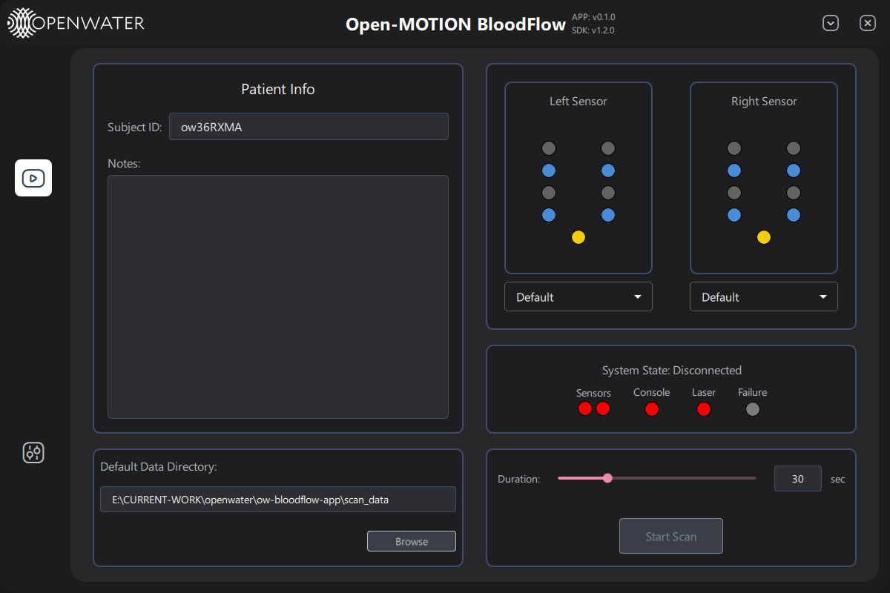

# OpenMOTION Bloodflow Application

Python Application UI for OPEN Motion Bloodflow monitoring 

## Installation

### Prerequisites
- **Python 3.9 or later**: Make sure you have Python 3.9 or later installed on your system. You can download it from the [official Python website](https://www.python.org/downloads/).

